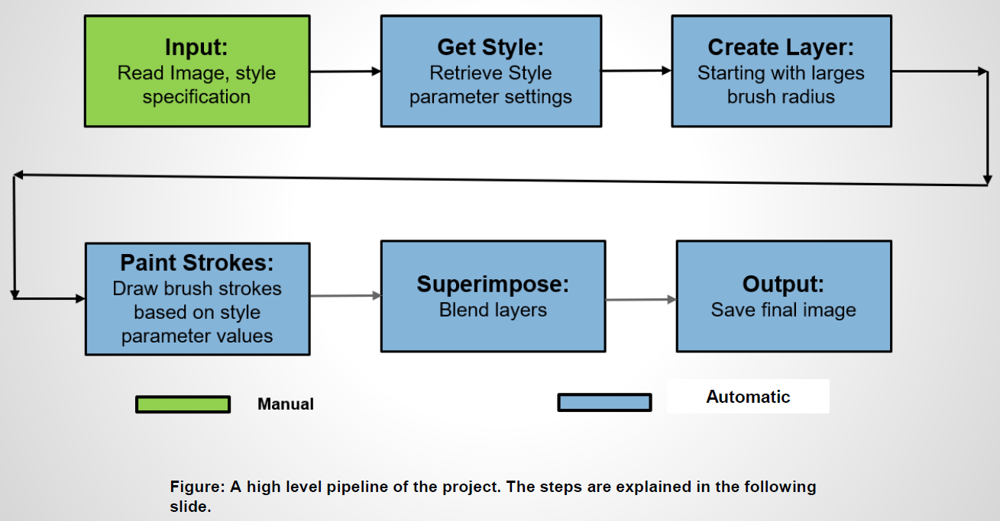

# Computational Photography (CS 6475) Final Project

# Artistic Strokes for Images
An application to render painted versions of photographs. The final image is formed by merging multiple layers of painterly layers each layer represents an image rendered with brush strokes of a specific radius. Using different style parameters, images are rendered in various painting stroke styles like Impressionist, Expressionist, Colorist Wash, Pointillist or a Generic style.

## Goal
This project is based on Painterly Rendering with Curved Brush Strokes Hertzmann , A., 1998]. Based on the information in the paper, the original scope of the project consists of the following –

* Define artistic styles with their parameters.
  * The ‘Generic’ style will have assumed parameters like brush sizes, grid size etc. for replication of figures 3(a) and (b) in the research paper. The paper only specifies the radii of the brush strokes. So, all other parameter values will be assumed.
  * ‘Impressionist’, ‘Expressionist’, ColoristWash ’, and ‘Pointillist’ styles will use parameters as specified in the paper
  
 *  A layer will be produced for each of the specified radii [starting with the thickest brush size]. These layers will be super imposed in decreasing order of brush size in order to produce an image increasing detail.
 
 *  An image rendering method will be implemented for each layer paintLayer algorithm in [1]]. Two methods will be implemented for rendering brush strokes.
  * Make_stroke This will be a multi scale function which will paint layers using the ‘Generic’ style parameters. It will produce two outputs : (1) an image painted with ‘circle as a brush stroke and (2) an image with short anti aliased line strokes.
  
  * Make_spline_stroke (): This function will find stroke points within an image grid. These stroke points will be the path to draw a curved brush stroke passing through the points. The length of the stroke will be based on the ‘Impressionist’, ‘Expressionist’, ‘Colorist Wash’, or ‘Pointillist’ style parameters.

 *  A paint() function will be implemented to superimpose the painted layers one on top of the other. The layer produced with the smallest brush sized will be on top. If given brush sizes are 8, 4, and 2, then,
  * Layer for radius 8 will be produced.
  * Layer for radius 4 will be produced. This layer will be merged on top of the previous layer.
  * Layer for radius 2 will be produced. This layer will be merged on top of the previous layer. This will be the final result.
  
##  Showcase:

##  Project Pipeline
    
  
      
  
   
  * Input: Input image name and style specification:: Input image name and style specification:
    e.g.: python.exe ./painterly.py python.exe ./painterly.py image_name.jpg 1
    
    1 – is the style specification number for Impressionist styleis the style specification number for Impressionist style
    
  * Get Style: Retrieve the parameters of the user: Retrieve the parameters of the user-specified painting style. This includes specified painting style. This includes approximation threshold, brush sizes, curvature filter, blur factor, minimum and maximum approximation threshold, brush sizes, curvature filter, blur factor, minimum and maximum stroke lengths, opacity, grid size, and color jitter.stroke lengths, opacity, grid size, and color jitter.
  
  * Create Layer: The : The paint_generic layer is much simpler it simply places a circle/anti aliased line on a stroke point. As the name suggests, it uses the ‘Generic’ style parameters. The paint_layer () function is for long curved brush strokes. It is used for ‘Impressionist’, ‘Expressionist’, ‘Colorist Wash’, and ‘Pointillist’ styles. Paint_layer calls the paint_stroke () method with implements a rounded tip brush and this tip will draw spline stroke across the stroke points. These methods invoke the functions to draw the brush strokes on layers. Make_stroke () is called for ‘Generic’ style
painting and make_spline_stroke () is called for other styles.

  * Paint Strokes: The paint_layer function invokes make_spline_stroke () this will render long curved brush strokes circular brush strokes. Make_stroke is called by
paint_generic_layer (). Make_stroke simple places a circle or a short anti aliased brush stroke on each stroke point on the grid.

  * Superimpose: The paint_layer function will blend the layers, one on top of another to produce a fairly detailed painting of the input image.
  
  * Output: Save the final image.
  
## Result Sets
* All input files for Generic style can be found here: [link](https://drive.google.com/drive/folders/1JheSuR81CjEqMC4Wu9F-scmnUKcKg7yB?usp=sharing)
* All output results can be viewed here: [link](https://drive.google.com/drive/folders/1qTxX0Iv_cqVme2xFVz9JpLIJNVBk5Tyx?usp=sharing)

### Generic style results
 #### oranges.jpg
 
 
 #### vases.jpg
 
 
 #### fruits.jpg
 
 
 #### tomatoes.jpg
 
 
### Circle stroke results
#### oranges.jpg

#### vases.jpg

#### fruits.jpg

#### tomatoes.jpg

### Anti-aliased stroke results
#### oranges.jpg

#### vases.jpg

#### fruits.jpg

#### tomatoes.jpg

### Impressionist, Expressionist, Colorist Wash and Pointillist Styles
#### oranges.jpg
 
 
#### vases.jpg
 
 
#### fruits.jpg
 
 
#### tomatoes.jpg
 
 
### Impressionist Style
#### oranges.jpg

#### vases.jpg

#### fruits.jpg

#### tomatoes.jpg

### Expressionist Style
#### oranges.jpg

#### vases.jpg

#### fruits.jpg

#### tomatoes.jpg

### Colorist Wash Style results
#### oranges.jpg

#### vases.jpg

#### fruits.jpg

#### tomatoes.jpg

### Pointillist Style results  
#### oranges.jpg

#### vases.jpg

#### fruits.jpg   

#### tomatoes.jpg

### Style Parameters:

## Project Development
### Progress:
  * Based on [SIGGRAPH ’98 ––[1]], I started out with a basic skeleton of the code by following the algorithm in the paper.
  * I started working with the ‘tomatoes’ image in the Figure 2(a) in the paper with only a single radius/layer.
  * Once I could get the basic code to produce prsentable result, I started to build the rest of the features around it like producing multiple layers and superimposing them.
  * I initially planned on using the same functions for ‘Generic’ and other styles, but decided against it later as it would have made the code unreadable and too complicated.
  * Throughout the development of this application, I came across a lot of ambiguities and confusing information in the paper, which w ill be discussing in the later slides.

### Problems and Solutions:
  * I implemented a function to produce painted layers created with radii 8, 4, and 2 brush strokes. However, the colors appeared too dull and did not match the original image
colors at all. I later realized this was because, the algorithm applies Gaussian blurring on the source_image and uses it as a reference image. I was passing the wrong parameters to OpenCV’s GaussianBlur function. E.g.: for a radius of 8, I passed kernel size as (radius + 1) i.e.: 9. The kernel size should have been ( blur_factor * radius) + 1, as given in the paper. (1 is added if the value if even as the GaussianBlur requires ksize to be positive and odd. Once I corrected this, the results were much better.
The difference can be observed from the figures below:

 * Below are the individual layers produced by using the wrong kernel size. Another problem here was that, the layer for radius 2 was not picking up all the stroke points in the canvas. The canvas has a plain black background initially. I later set the canvas to a constant color with a high integer value, so the that difference calculated with the reference image in paint_layer() is high enough to pass the threshold check which is used to retrieve all the valid stroke points.

 * Approximation threshold value also makes a big difference in the retrieving all the valid stroke points in the canvas. I observed that the reducing the threshold to an appropriate value makes sure that all the stroke points are retrieved.

### Ambiguities in the original paper
  * In the figure 2(b), (c), and (d) in the paper, it is mentioned that the images were produced with radii 8, 4, and 2. However there is no mention of what style is used to get the results.
  * In the Section 3.1 ‘Some style parameters’, it is vaguely implied that Figures 3(f) are rendered in impressionist style, but there is no Figure 3(f) in the paper. In addition to that, the caption for Figures 3 (a) and (b), mentions that the strokes are drawn using the circle as a brush stroke or short anti aliased lines as strokes. Section 2.1 with the paint_layer algorithm says that ‘ Figure 3(a) shows an image illustrated using a “ makeStroke ()” procedure which simply places a circle of the given radius at ( x,y ), using the color of the source image at location ( x,y ). Figure 3(b) shows an image illustrated with short brush strokes, aligned to the normals of image gradients.’ So Figures 3(a and b) are said to use the make_stroke algorithm, which does not use the style parameters for Impressionist paintings.
  * To overcome this, I have assumed some style parameters in the ‘Generic’ style to produce results similar to that in Figures 3.
  * I have also produced results similar to figure 2 using Impressionist style. They do not match the paper exactly. So I am assuming that some of the style parameters are to be modified to achieve the desired results

### Good and failed interim results
  * I got the best results with the tomatoes image in the paper. Below are some images in Impressionist style, produced with different values of approximation threshold. I decided to keep threshold value =50 for impressionist style.

  * Below is an image I discarded, as it did not produce satisfactory results even after a lot playing with the Expressionist style parameters. This is probably because the background is blurred and there is too much going on.

### Functional Description:

  * The creation of layers for each radius start in the paint functions paint() or paint_generic
    ** Paint: The function applies a Gaussian blur to the source image with the current radius. The kernel size for the Gaussian kernel is calculated as:
      *** Blur_factor * radius
      *** However, OpenCV’s Gaussian kernel size needs to be positive and odd. To satisfy this condition, the kernel size is calculated as follows:
          if (radius * BLUR _FACTOR)%2 == 0 then
              ksize = (radius * BLUR _FACTOR) + 1
          else
              ksize = radius * BLUR _FACTOR
  * Once the reference image is obtained from the Gaussian blur, the paint_layer () (or paint_generic_layer () function) is invoked.
  * Paint_layer:
    ** This function calculates a pointwise difference image of the canvas and reference_image. Here, the key is to set th e cavas color to a high integer value so the the difference calsulated it high enough to pass the threshold check later on in the function. I set the canvas value to 550 as follows:
      
      canvas = np.zeros(source_image.shape , dtype =np.uint8)
      canvas.fill(-550)
    ** The difference D is calculated as:
       D = |(r1,g1,b1) ––(r2,g2,b2)| = ((r1 - r2)^2 + (g1 - g2)^2 + (b1 - b2)^2)^1/2
    ** The luminance of the image is calculated as L(r,g,b) = 0.30*r + 0.59*g + 0.11 b (as given in the paper.)
    ** Gradient of the image is determined by using the Sobel filtered Luminance values.
    ** The grid is calculated as grid_size radius
    ** For each grid in the image:
       *** The grid error is calculated from the difference image in order to find the correct stroke points.
           M = D[ y:y+grid , x:x+grid]
           error = sum(M) / grid^2
           
           If areaError >>(APPROXIMATION_THRESHOLD / radius then
             (x1, y1) = argmax(M)
             
       *** Note: In the paper the threshold is not divided by the radius for the threshold check. I have done this as a step to make sure that as many stroke points on the canvas can be retrieved as possible. That is only possible if the threshold check is passed.
       ** For Generic style paintings, The ( y1) coordinates in the grid are used to make call to the make_stroke () which is explained
       ** For other styles, the make_spline_stroke method is called to retrieve the stroke points of a long curved stroke.
       ** At this point all the strokes retrieved are shuffled in a random order and the canvas is painted. The shuffling helps create a natural hand painted look. For styles other than ‘Generic’, the paint_stroke () function is invoked.
       
    * Make_stroke: This function is used for producing ‘Generic’ style paintings. It creates two copies of the canvas and paints it.
      ** One canvas is painted by placing a ‘circle’ as a stroke at the (x, y) point passed as a parameter to this function. The radius of the layer is used as a radius of the circle. ‘color’ is color of the stroke from source image.
         cv2.circle( circle_based_image , (int(x), int(y)), radius, color, 1)
         
      ** The canvas is painted with short strokes which are anti alias lines painted at a hard coded angle from the given point.
         cv2.line( line_based_image , (x, y), (x1, y1), color, style.MAXIMUM_STROKE_ LENGTH (=5), lineType =cv2.LINE_AA)
     
    * Make_spline_stroke: This is the most vital method as it retrived the stroke point on the long curved strokes need for the painterly effect.
      ** The stroke color is retrieved from the Gaussian blurred reference image.
      ** The initial (x, y) value are the starting points of the stroke. The co-ordinates of this point are passed from the paint_layer.
          For I =0 to maximum_stroke_length
          *** Compute and compare the absolute difference between colors of the ( reference_image and canvas) and ( reference_image and stroke_color )
          *** If i minimum_stroke_length and reference_image canvas reference_image stroke_color ) or if the gradient magnitude is
                 Return the existing stoke points from the function.
          *** Find direction of the stroke point from the gradient computed earlier
          *** To minimize the stroke curvature, the stroke direction can be reversed ad dx, dy = dx, dy
          *** Next the stroke direction is filtered using the curvature_filter parameter as:
              D’i = fc Di + (1 - fc) D’i - 1 = (fc dxi + (1 - fc ) dx’i - 1 , fc dyi + (1 - fc) dy’i - 1)

### Comparison
   A comparison of the results produced by the application with those found in the author’s website ––[2].

#### Impressionist Style: Left ( output from my program), Right (sample output from authors website)

#### Expressionist Style: Left ( output from my program), Right (sample output from authors website)

## References:
[1] Hertzmann , A., 1998] Painterly Rendering for Curved Brush Strokes. Retrieved from https://www.mrl.nyu.edu/publications/painterly98/hertzmann-siggraph98.pdf
[2] Author website https://www.mrl.nyu.edu/publications/painterly98
[3] Tomatoes sample picture retrieved from https://www.mrl.nyu.edu/projects/npr/painterly
