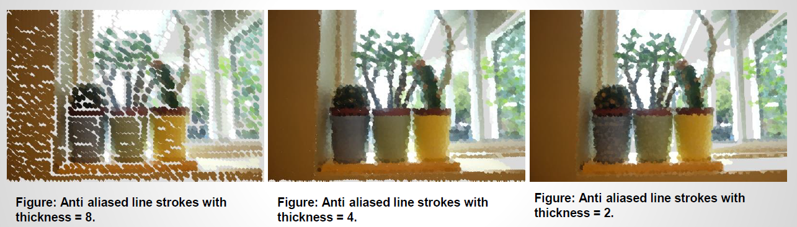
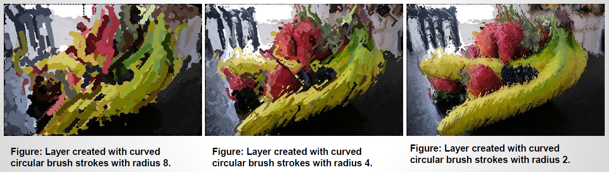
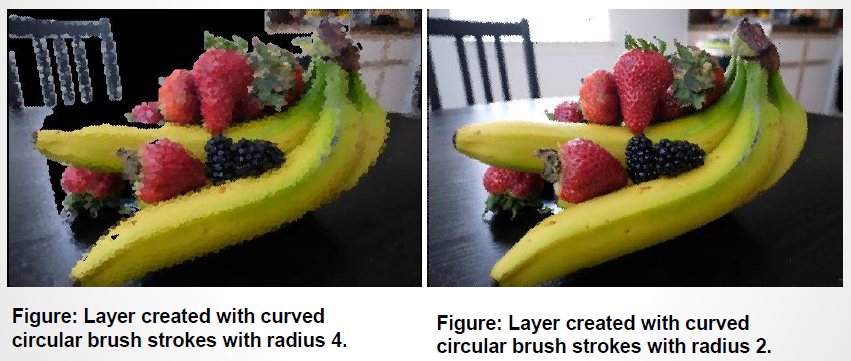
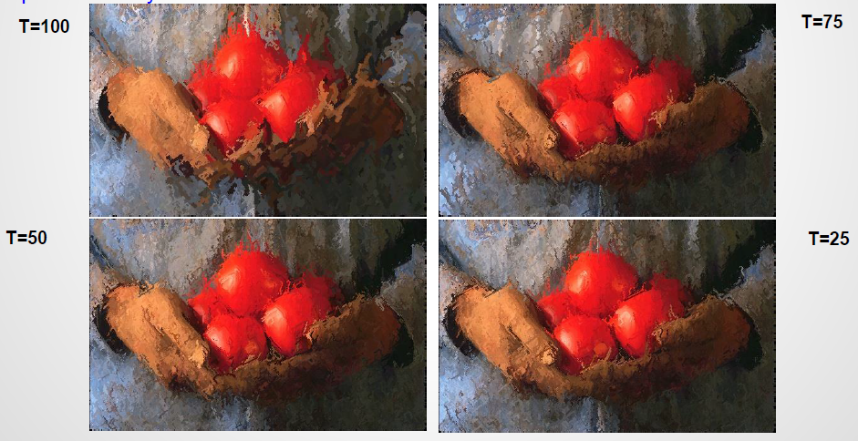

# Computational Photography (CS 6475) Final Project

# Artistic Strokes for Images
An application to render painted versions of photographs. The final image is formed by merging multiple layers of painterly layers each layer represents an image rendered with brush strokes of a specific radius. Using different style parameters, images are rendered in various painting stroke styles like Impressionist, Expressionist, Colorist Wash, Pointillist or a Generic style.

## Goal
This project is based on Painterly Rendering with Curved Brush Strokes Hertzmann , A., 1998]. Based on the information in the paper, the original scope of the project consists of the following –

* Define artistic styles with their parameters.
  * The ‘Generic’ style will have assumed parameters like brush sizes, grid size etc. for replication of figures 3(a) and (b) in the research paper. The paper only specifies the radii of the brush strokes. So, all other parameter values will be assumed.
  * ‘Impressionist’, ‘Expressionist’, ColoristWash ’, and ‘Pointillist’ styles will use parameters as specified in the paper
  
 *  A layer will be produced for each of the specified radii [starting with the thickest brush size]. These layers will be super imposed in decreasing order of brush size in order to produce an image increasing detail.
 
 *  An image rendering method will be implemented for each layer paintLayer algorithm in [1]]. Two methods will be implemented for rendering brush strokes.
  * Make_stroke This will be a multi scale function which will paint layers using the ‘Generic’ style parameters. It will produce two outputs : (1) an image painted with ‘circle as a brush stroke and (2) an image with short anti aliased line strokes.
  
  * Make_spline_stroke (): This function will find stroke points within an image grid. These stroke points will be the path to draw a curved brush stroke passing through the points. The length of the stroke will be based on the ‘Impressionist’, ‘Expressionist’, ‘Colorist Wash’, or ‘Pointillist’ style parameters.

 *  A paint() function will be implemented to superimpose the painted layers one on top of the other. The layer produced with the smallest brush sized will be on top. If given brush sizes are 8, 4, and 2, then,
  * Layer for radius 8 will be produced.
  * Layer for radius 4 will be produced. This layer will be merged on top of the previous layer.
  * Layer for radius 2 will be produced. This layer will be merged on top of the previous layer. This will be the final result.
  
##  Showcase:

##  Project Pipeline
    
  
      
  
   
  * Input: Input image name and style specification:: Input image name and style specification:
    e.g.: python.exe ./painterly.py python.exe ./painterly.py image_name.jpg 1
    
    1 – is the style specification number for Impressionist styleis the style specification number for Impressionist style
    
  * Get Style: Retrieve the parameters of the user: Retrieve the parameters of the user-specified painting style. This includes specified painting style. This includes approximation threshold, brush sizes, curvature filter, blur factor, minimum and maximum approximation threshold, brush sizes, curvature filter, blur factor, minimum and maximum stroke lengths, opacity, grid size, and color jitter.stroke lengths, opacity, grid size, and color jitter.
  
  * Create Layer: The : The paint_generic layer is much simpler it simply places a circle/anti aliased line on a stroke point. As the name suggests, it uses the ‘Generic’ style parameters. The paint_layer () function is for long curved brush strokes. It is used for ‘Impressionist’, ‘Expressionist’, ‘Colorist Wash’, and ‘Pointillist’ styles. Paint_layer calls the paint_stroke () method with implements a rounded tip brush and this tip will draw spline stroke across the stroke points. These methods invoke the functions to draw the brush strokes on layers. Make_stroke () is called for ‘Generic’ style
painting and make_spline_stroke () is called for other styles.

  * Paint Strokes: The paint_layer function invokes make_spline_stroke () this will render long curved brush strokes circular brush strokes. Make_stroke is called by
paint_generic_layer (). Make_stroke simple places a circle or a short anti aliased brush stroke on each stroke point on the grid.

  * Superimpose: The paint_layer function will blend the layers, one on top of another to produce a fairly detailed painting of the input image.
  
  * Output: Save the final image.
  
## Demonstration: Result Sets
### Generic Style - Oranges.jpg
    * All input files for Generic style can be found here: [link]
    * Results of Generic style painterly rendering: [link]
    
 
 
#### Circle strokes
   * Results of Generic style painterly rendering: [link]
   

#### Anti-aliased strokes
   * Results of Generic style painterly rendering: [link]
   

### Generic Style - vases.jpg
    * All input files for Generic style can be found here: [link]
    * Results of Generic style painterly rendering: [link]
    
 
 
#### Circle strokes
   * Results of Generic style painterly rendering: [link]
   

#### Anti-aliased strokes
   * Results of Generic style painterly rendering: [link]
   

### Generic Style - fruits.jpg
    * All input files for Generic style can be found here: [link]
    * Results of Generic style painterly rendering: [link]
    
 
 
#### Circle strokes
   * Results of Generic style painterly rendering: [link]
   

#### Anti-aliased strokes
   * Results of Generic style painterly rendering: [link]
   

### Generic Style - tomatoes.jpg
    * All input files for Generic style can be found here: [link]
    * Results of Generic style painterly rendering: [link]
    
 
 
#### Circle strokes
   * Results of Generic style painterly rendering: [link]
   

#### Anti-aliased strokes
   * Results of Generic style painterly rendering: [link]
   

### Impressionist, Expressionist, Colorist Wash and Pointillist Style - oranges.jpg
    * All input files for Generic style can be found here: [link]
    * Results of Generic style painterly rendering: [link]
    
 
 
#### Impressionist Style - oranges.jpg
   * Results of Generic style painterly rendering: [link]
   

#### Expressionist Style - oranges.jpg
   * Results of Generic style painterly rendering: [link]
   

#### Colorist Wash Style - oranges.jpg
   * Results of Generic style painterly rendering: [link]
   

#### Pointillist Style - oranges.jpg
   * Results of Generic style painterly rendering: [link]
   

### Impressionist, Expressionist, Colorist Wash and Pointillist Style - vases.jpg
    * All input files for Generic style can be found here: [link]
    * Results of Generic style painterly rendering: [link]
    
 
 
#### Impressionist Style - vases.jpg
   * Results of Generic style painterly rendering: [link]
   

#### Expressionist Style - vases.jpg
   * Results of Generic style painterly rendering: [link]
   

#### Colorist Wash Style - vases.jpg
   * Results of Generic style painterly rendering: [link]
   

#### Pointillist Style - vases.jpg
   * Results of Generic style painterly rendering: [link]
   

### Impressionist, Expressionist, Colorist Wash and Pointillist Style - fruits.jpg
    * All input files for Generic style can be found here: [link]
    * Results of Generic style painterly rendering: [link]
    
 
 
#### Impressionist Style - fruits.jpg
   * Results of Generic style painterly rendering: [link]
   

#### Expressionist Style - fruits.jpg
   * Results of Generic style painterly rendering: [link]
   

#### Colorist Wash Style - fruits.jpg
   * Results of Generic style painterly rendering: [link]
   

#### Pointillist Style - fruits.jpg
   * Results of Generic style painterly rendering: [link]
   

### Impressionist, Expressionist, Colorist Wash and Pointillist Style - tomatoes.jpg
    * All input files for Generic style can be found here: [link]
    * Results of Generic style painterly rendering: [link]
    
 
 
#### Impressionist Style - tomatoes.jpg
   * Results of Generic style painterly rendering: [link]
   

#### Expressionist Style - tomatoes.jpg
   * Results of Generic style painterly rendering: [link]
   

#### Colorist Wash Style - tomatoes.jpg
   * Results of Generic style painterly rendering: [link]
   

#### Pointillist Style - tomatoes.jpg
   * Results of Generic style painterly rendering: [link]
   

### Result Set:

### Project Development

#### Problems

#### Good and failed results

### Comparison

